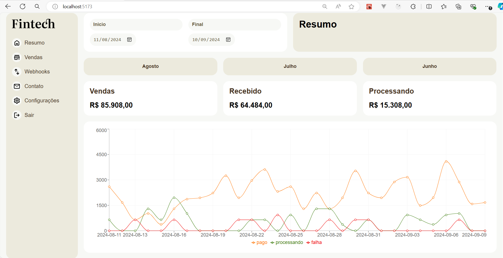
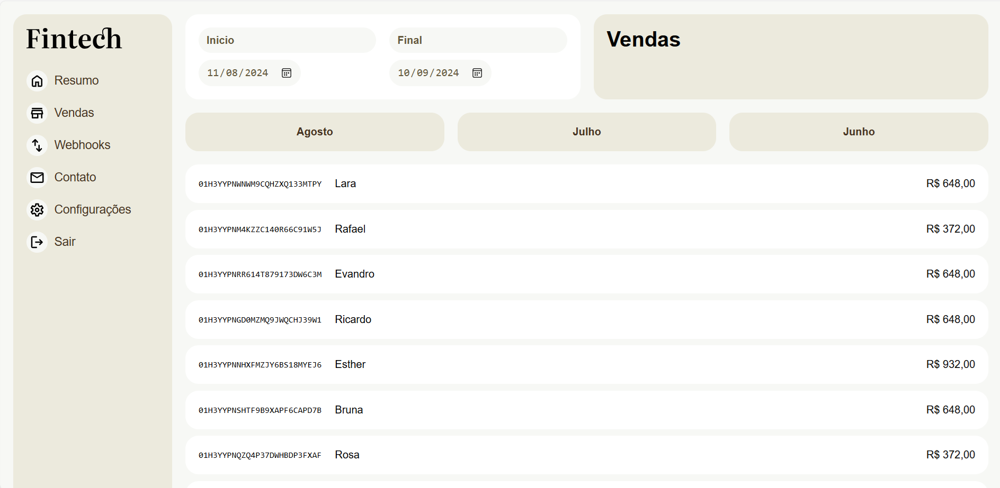

# Dashboard Financeiro

Este é um projeto usando React, Vite, React Router DOM, onde você pode consultar suas transações além de um gráfico para visualizar melhor.

## Capturas de Tela

### Menu Principal


### Vendas


## Tecnologias Utilizadas

- React
- Vite
- React Router DOM

## Funcionalidades

- Consulta de transações financeiras
- Visualização de gráficos para melhor análise das transações

## Como Usar

1. Clone o repositório:
    ```bash
    git clone https://github.com/seu-usuario/seu-repositorio.git
    ```
2. Instale as dependências:
    ```bash
    cd seu-repositorio
    npm install
    ```
3. Inicie o projeto:
    ```bash
    npm run dev
    ```